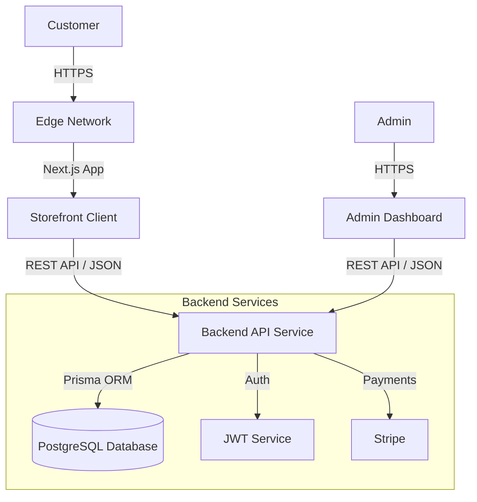

# System Architecture

## Overview
The Force E-Commerce Platform is built as a modern **Monorepo** containing three main pillars:
1. **Storefront (Root)**: A high-performance Next.js application for customers.
2. **Backend API (`packages/api`)**: A robust Express.js REST API handling business logic and data persistence.
3. **Admin Dashboard (`packages/admin`)**: A dedicated Next.js application for store management.

---

## 🏗️ Architecture Diagram



---

## 1. Frontend Storefront (Root)
The customer-facing application is designed for speed, SEO, and premium aesthetics.

- **Framework**: [Next.js 14+](https://nextjs.org/) (App Router)
- **Styling**: [Tailwind CSS](https://tailwindcss.com/) + Custom Design Tokens
- **Animations**: [Framer Motion](https://www.framer.com/motion/)
- **State Management**: [Zustand](https://github.com/pmndrs/zustand)
  - `useAuth`: Manages user session and authentication status.
  - `useCart`: Manages local cart state and synchronization.
  - `useCurrency`: Handles multi-currency support.
- **API Integration**: Centralized `api-client.ts` using native `fetch` with credential handling.

### Key Features
- **Authentication**: Custom Login Modal, OTP Verification Flow, Secure HttpOnly Cookies.
- **Account Management**: Profile, Order History, Address Book (`/account`).
- **Product Discovery**: Dynamic Collections, Search Overlay, filtering.

---

## 2. Backend API (`packages/api`)
The core logic layer focusing on security, data integrity, and performance.

- **Runtime**: Node.js with [TypeScript](https://www.typescriptlang.org/)
- **Framework**: [Express.js](https://expressjs.com/)
- **Database ORM**: [Prisma](https://www.prisma.io/)
- **Database**: PostgreSQL (Google Cloud SQL / Local / Supabase)
- **Authentication**: 
  - JWT (JSON Web Tokens) for stateless session management.
  - `bcryptjs` for secure password hashing.
  - OTP (One-Time Password) system for email verification.

### Key Endpoints
- `/api/auth`: Register, Login, Verify OTP, Resend OTP, Get Me.
- `/api/products`: CRUD operations for inventory.
- `/api/orders`: Order placement, history fetching.
- `/api/admin`: Protected routes for dashboard metrics.

---

## 3. Admin Dashboard (`packages/admin`)
A restricted-access internal tool for business operations.

- **Framework**: Next.js (App Router)
- **Access Control**: Role-based access (ADMIN role required).
- **Features**:
  - **Dashboard**: Real-time sales stats, recent orders.
  - **Product Management**: Add/Edit/Delete products, image uploads.
  - **Order Management**: Update status (Pending -> Shipped), view details.
  - **Customer View**: User lists and history.

---

## 4. Infrastructure & DevOps
- **Package Manager**: NPM (likely with Workspaces/Turborepo implicit structure).
- **Environment**: 
  - Local Development: `npm run dev` (Concurrent execution).
  - Production: Docker-ready (implied by Dockerfiles).
- **Security**:
  - **CORS**: Strictly configured for allowed origins.
  - **Cookies**: `HttpOnly`, `Secure`, `SameSite` attributes.
  - **Validation**: [Zod](https://zod.dev/) schemas for runtime request validation.

## 5. Directory Structure
```
/
├── src/                  # Storefront Source Code
│   ├── app/              # Next.js Pages & Routes
│   ├── components/       # Reusable UI Components
│   ├── lib/              # Utilities & API Client
│   └── store/            # Global State (Zustand)
│
├── packages/
│   ├── api/              # Backend Express App
│   │   ├── src/
│   │   │   ├── controllers/
│   │   │   ├── routes/
│   │   │   ├── middleware/
│   │   │   └── config/
│   │   └── prisma/       # Database Schema & Migrations
│   │
│   └── admin/            # Admin Next.js App
│       └── app/          # Admin Routes
```
